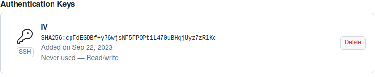
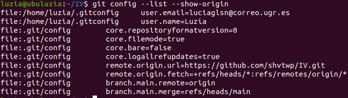

# Problema

## Descripción del problema

La familia de una persona en situación de dependencia necesita repartirse el cuidado de la misma de forma que tengan horarios lo más equitativos posible, teniendo en cuenta la disponibilidad de los mismos y que no pueden dejar a esa persona sola en ningún momento. En el caso de que nadie pueda en cierto momento, contratarán a un auxiliar de enfermería, pero como no disponen de muchos fondos, prefieren minimizar las horas en las que la persona dependiente está en manos de un profesional.

# Configuración de GitHub

## Perfil de GitHub

## Clave SSH

## Configuración

